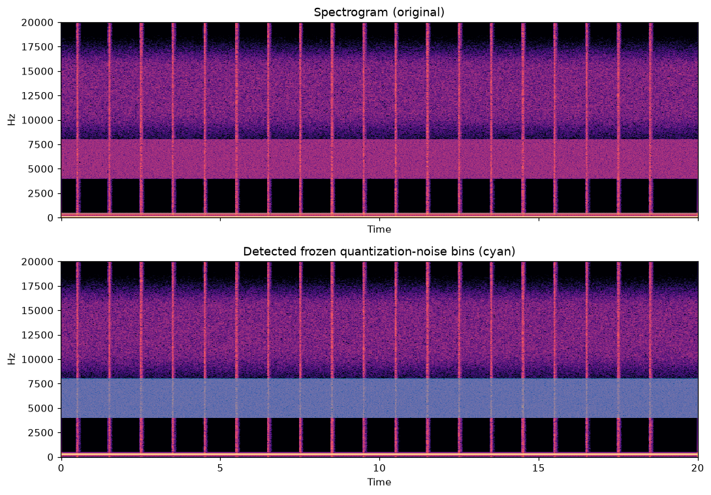
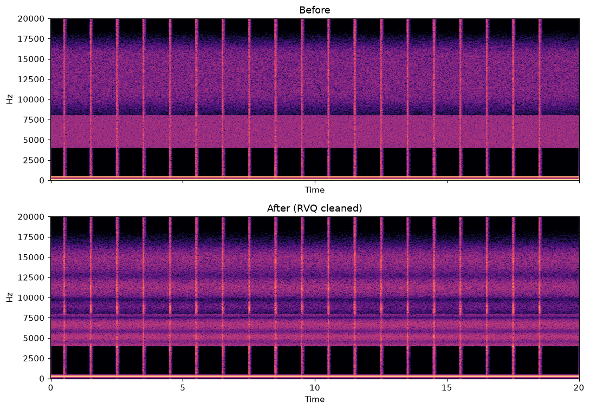

# RVQ Artifact Remover

[](https://github.com/leckminartor/rvq-artifact-remover/actions/workflows/ci.yml)
[](https://www.python.org/downloads/)
[](LICENSE)
[](CHANGELOG.md)
[](https://paypal.me/klausminator)

**Offline removal of neural-codec (RVQ) quantization artifacts from AI-generated music.**

AI music generators (Suno, Udio, MusicGen, Stable Audio, YuE, ...) compress
their output with Residual Vector Quantization codecs (EnCodec, SoundStream,
DAC, X-Codec). The quantization residuals survive into the decoded audio as
repeatable, structured artifacts - a metallic "frozen" noise floor, codec
frame-rate buzz, smeared transients and artificial air. **These are not
mastering problems**: EQ and compression can only mask them. This tool
analyzes the artifact structure and removes it at the codec level.

```
AI audio -> 1. Comb-ripple flattener    (cancels codec frame-rate AM buzz, incl. harmonics)
             2. Frozen-noise unfreezer  (de-metalizes the static noise floor)
             3. Pre-echo guard          (removes codec ghost echo before hits)
             4. Transient restoration   (restores drum punch)
             5. De-metal adaptive gate  (removes the music-following metallic sheen)
             6. Adaptive air-band roll-off (tames contentless HF)
        -> [optional] 7. AI neural stage: Demucs separation + per-stem cleanup
           + residual cancellation (kills the hall / artifact share)
        -> 24-bit WAV
```

## Screenshots

**Analysis view** - spectrogram with detected frozen quantization-noise bins (cyan):



**Before / after processing** (synthetic RVQ-damage benchmark):



## Features

- **Signal-adaptive by design** - every stage detects before it modifies;
  transparent on clean material.
- **Codec frame-rate detection** - scans 10-125 Hz for coherent AM lines and
  reports the actual codec rate of your file (works for YuE/X-Codec too).
- **Phase-aware frozen-noise detection** - robust std + phase-randomness test
  distinguishes quantization noise from real sustained tones.
- **De-metal adaptive gate** - minimum-statistics noise estimation removes the
  music-following metallic sheen (the "AI hall" background) that static-bin
  detection misses; sustained tones are protected.
- **Pre-echo guard** - removes the ghost echo the codec leaks in front of
  sharp transients.
- **Optional AI neural stage** - Demucs separation re-synthesizes stems
  through a clean-audio prior; per-stem targeted cleanup; artifact-aware
  recombination with residual cancellation. The biggest single quality
  jump for the "de-AI" goal.
- **Desktop app (Gradio)** with live progress, cancel button and metric
  reports, or fully scriptable CLI.
- **GPU acceleration** - CUDA torch wheels auto-detected (verified on RTX 3060).

## Installation

```bash
git clone https://github.com/leckminartor/rvq-artifact-remover.git
cd rvq-artifact-remover
pip install -e ".[app,dev]"
```

Optional AI neural stage (heavy: pulls torch):

```bash
# NVIDIA GPU (recommended)
pip install torch torchaudio --index-url https://download.pytorch.org/whl/cu128
# CPU only
pip install torch torchaudio --index-url https://download.pytorch.org/whl/cpu
pip install demucs
```

## Usage

### Desktop app

```bash
rvq-remover-app          # or: python -m rvq_remover.app
```

Load a file, hit *Analyze artifacts* to inspect the damage (optional but
recommended - the report also tells you the detected codec frame rate), then
*Process / Remove artifacts*. Compare, download the 24-bit WAV result.

### CLI / batch

```bash
rvq-remover input.wav                         # writes input_derq.wav
rvq-remover input.wav out.wav --strength 0.8 --comb-freq 75
rvq-remover track.wav --neural --model htdemucs_ft
```

### As a library

```python
from rvq_remover.engine import load_audio, process, save_audio

y, sr = load_audio("track.wav")
y_out, report = process(y, sr, strength=0.6, comb_freq=75.0)
save_audio("track_clean.wav", y_out, sr)
```

## Settings

| Setting | Effect |
|---|---|
| Strength | Overall depth of all removal stages (0-100). Start at 60. |
| Artifact band start (Hz) | Lower bound of the treated HF band (default 4000). |
| Codec frame rate | 75 Hz = EnCodec (most models), 50 Hz = many SoundStream variants. Use the detected value from the analysis for other codecs (e.g. YuE/X-Codec-2.0). |
| Comb-ripple flattener | Cancels the frame-rate AM buzz (incl. 2x/3x harmonics). |
| Frozen-noise unfreezer | De-metalizes the static HF noise floor. |
| Pre-echo guard | Removes codec ghost echo before transients. |
| Transient restoration | Restores drum punch. Disable for ambient material. |
| De-metal adaptive gate | Removes music-following metallic noise ("AI hall" sheen). |
| Adaptive air-band roll-off | Tames artificial, contentless "air". |
| AI neural stage | Demucs separation + per-stem cleanup. Enable for final renders; `htdemucs_ft` = best quality. |
| Demucs residual retention | How much of the mix-minus-stems residual (room/pads vs artifacts) is kept (default 30 %). |

## How it works

1. **Comb-ripple flattener** - RVQ codecs quantize in time frames (e.g. 75 Hz
   for EnCodec), imprinting amplitude modulation at the frame rate on the high
   band. The tool measures the coherent modulation line on log-spaced HF
   sub-band envelopes and notches that line plus its 2x/3x harmonics, leaving
   slower musical dynamics untouched.
2. **Frozen-noise unfreezer** - quantization residuals appear as spectral bins
   with a static level across the whole file. Detection uses a
   transient-trimmed robust temporal std plus a phase-randomness test (static
   level + random phase walk = codec noise; static level + linear phase =
   real sustained tone, protected). Flagged bins are attenuated and
   re-naturalized with TPDF dither at independent phase.
3. **Pre-echo guard** - codec windows smear sharp hits into the preceding
   quiet frames; those frames are attenuated on the HF band while the hit
   frame itself stays untouched.
4. **Transient restoration** - percussive transients lost to codec
   smearing are re-applied as fast gain on the HF band.
5. **De-metal adaptive gate** - codec noise that follows the music is not
   static and slips past the unfreezer; it reads as a metallic sheen or thin
   artificial hall. A per-bin noise floor from rolling minimum statistics
   feeds a Wiener-style over-subtraction gate with smoothed gains; sustained
   tones are protected and treated bins get TPDF dither.
6. **Adaptive bandlimit** - above the detected musical energy edge, RVQ noise
   dominates but content does not; a gentle shelf lowers it.
7. **AI neural stage (optional)** - Demucs separation as neural restoration:
   codec noise that belongs to no instrument disappears when stems are
   recombined; each stem then receives targeted cleanup (bass skips the comb
   stage, drums get extra transient restoration). The mix-minus-stems
   residual is HF-tamed and partially retained (residual cancellation) so
   room and pad content survive while its metallic HF is rolled off.

## Verification

`tests/test_synthetic.py` injects a realistic RVQ damage model (static
spectral-envelope noise with natural phase evolution + 75 Hz AM of HF noise)
and asserts that comb periodicity, frozen-noise energy and metallic flatness
drop while length, loudness and peak safety are preserved.

| Metric (synthetic benchmark) | Untouched | DSP stages | DSP + AI stage |
|---|---|---|---|
| Comb depth @75 Hz | 0.512 | 0.222 | **0.139** |
| Frozen-noise energy (HF) | 0.704 | 0.144 | **0.003** |

Run it yourself: `pytest tests/ -v`

## Known limitations

- Offline processing: roughly 36 s for a 2-minute stereo track including the
  AI neural stage on an RTX 3060 (~4 min before v0.2.0); CPU-only machines
  are slower for the neural separation step.
- Extreme strength settings can dull the top end; use the before/after report.
- Frame-rate detection assumes a constant codec rate per file (true for all
  common AI music generators).

## Roadmap

- [ ] Real-time mode for the DSP stages
- [ ] Per-stem strength presets exposed in the UI
- [ ] Additional artifact metrics (stereo-image stagnation, modulation noise)
- [ ] Optional band extension model for restored HF content

## Support

If this tool saved your AI tracks, consider buying me a coffee - it keeps the
updates coming:

[](https://paypal.me/klausminator)

## Contributing

See [CONTRIBUTING.md](CONTRIBUTING.md). PRs welcome!

## License

[MIT](LICENSE) - (c) 2026 leckminartor

## Citing

If this tool is useful in your research, please cite it
([CITATION.cff](CITATION.cff)):

```bibtex
@software{leckminartor_2026_rvq_artifact_remover,
  author  = {leckminartor},
  title   = {RVQ Artifact Remover - offline removal of neural-codec quantization artifacts from AI-generated music},
  version = {0.1.0},
  year    = {2026},
  url     = {https://github.com/leckminartor/rvq-artifact-remover}
}
```
